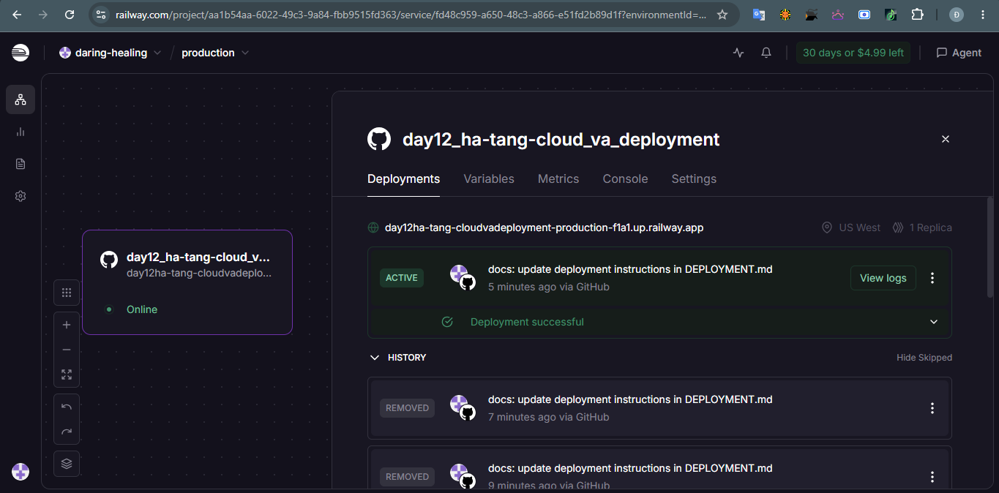
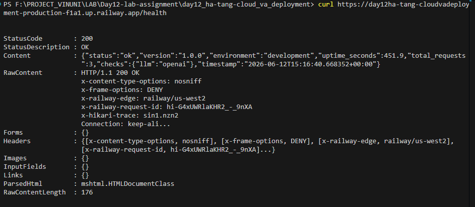
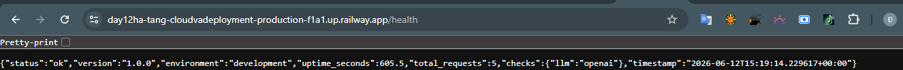
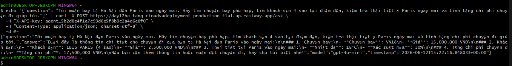

# Day 12 Lab - Mission Answers

## Part 1: Localhost vs Production

### Exercise 1.1: Anti-patterns found
1. **Hardcoded Secrets**: API Key được lưu trực tiếp dạng chuỗi trong mã nguồn (`api_key = "sk-..."`), dễ bị rò rỉ khi đẩy code lên các repository công khai như GitHub.
2. **Hardcoded Port**: Port được gán cố định là `8000` (`port = 8000`), không linh hoạt khi các cloud provider tự động gán port động qua biến môi trường `$PORT`.
3. **print() Logging**: Sử dụng lệnh `print()` thông thường thay vì structured logging, làm các hệ thống thu thập log tự động (như ElasticSearch, Grafana Loki) khó lọc và phân tích lỗi.
4. **Không có Health Checks**: Ứng dụng thiếu các endpoint `/health` và `/ready` để giám sát trạng thái hoạt động khiến container không thể tự khởi động lại khi bị treo hoặc lỗi kết nối dependencies.
5. **Tắt đột ngột (No Graceful Shutdown)**: Khi nhận lệnh ngắt tiến trình (SIGTERM), server tắt ngay lập tức làm ngắt quãng các requests đang được xử lý dở dang của người dùng.

### Exercise 1.3: Comparison table
| Feature | Basic (Develop) | Advanced (Production) | Tại sao quan trọng? |
|---------|---------|------------|----------------|
| **Config** | Hardcode trực tiếp trong code | Đọc qua biến môi trường (env vars) | Dễ dàng thay đổi cấu hình giữa các môi trường (Dev/Staging/Prod) mà không cần đổi code. |
| **Health check** | ❌ Không có | ✅ Có (`/health`, `/ready`) | Giúp Load Balancer và Cloud Platform theo dõi trạng thái sống/chết để tự động restart hoặc chuyển traffic. |
| **Logging** | `print()` thông thường | JSON structured logging | Logs có cấu trúc giúp công cụ giám sát dễ lọc, tìm kiếm và phân tích lỗi tự động. |
| **Shutdown** | Ngắt đột ngột | Graceful shutdown | Đảm bảo các request hiện tại được xử lý trọn vẹn trước khi tắt server, tăng độ tin cậy. |

---

## Part 2: Docker

### Exercise 2.1: Dockerfile questions
1. **Base image:** `python:3.11-slim` cung cấp hệ điều hành tối giản đã được cài sẵn Python 3.11 runtime, giúp tối ưu dung lượng tải và lưu trữ.
2. **Working directory:** `/app` là thư mục làm việc chính trong container nơi mã nguồn được copy vào.
3. **Tại sao COPY requirements.txt trước?** Để tận dụng Docker Layer Cache. Nếu file dependencies không đổi, Docker sẽ bỏ qua bước cài đặt (`pip install`) giúp thời gian build sau này cực nhanh.
4. **CMD vs ENTRYPOINT:**
   - `ENTRYPOINT` định nghĩa câu lệnh cố định chạy khi khởi động container.
   - `CMD` chứa tham số mặc định truyền vào `ENTRYPOINT` và có thể bị ghi đè dễ dàng từ dòng lệnh chạy container.

### Exercise 2.3: Image size comparison
- **Develop:** ~ 800 MB (dùng base image `python:3.11` đầy đủ công cụ compile)
- **Production:** ~ 160 MB (tối ưu hóa qua `python:3.11-slim` và multi-stage build)
- **Difference:** Giảm khoảng 80% dung lượng.

---

## Part 3: Cloud Deployment

### Exercise 3.1: Railway deployment
- **Public URL**: [https://day12ha-tang-cloudvadeployment-production-f1a1.up.railway.app/](https://day12ha-tang-cloudvadeployment-production-f1a1.up.railway.app/)
- **Screenshot Railway Dashboard**: 

- **Screenshot Test API Health Check**: 
```bash
curl https://day12ha-tang-cloudvadeployment-production-f1a1.up.railway.app/health
```




- **Screenshot Test API Question**: 
```bash
echo '{"question": "Tôi muốn bay từ Hà Nội đến Paris vào ngày mai. Hãy tìm chuyến bay phù hợp, tìm khách sạn 4 sao tại điểm đến, kiểm tra thời tiết ở Paris ngày mai và tính tổng chi phí chuyến đi giúp tôi."}' | curl -X POST https://day12ha-tang-cloudvadeployment-production-f1a1.up.railway.app/ask \
  -H "X-API-Key: agent_5b2d8e4f1a7c93d6e5f8b0c2a4d6e8f0" \
  -H "Content-Type: application/json; charset=utf-8" \
  -d @-
```

---

## Part 4: API Security

### Exercise 4.1-4.3: Test results
- **Không gửi API Key**: Server từ chối và trả về mã lỗi `401 Unauthorized` (`detail: Invalid or missing API key`).
- **Gửi sai API Key**: Server từ chối và trả về mã lỗi `401 Unauthorized`.
- **Gửi đúng API Key**: Server xử lý thành công, trả về mã trạng thái `200 OK` cùng phản hồi của Agent.
- **Spam requests vượt rate limit (quá 10 req/phút)**: Server từ chối và trả về mã lỗi `429 Too Many Requests`.

### Exercise 4.4: Cost guard implementation
- **Giải pháp**: Mỗi user được cấp một hạn mức chi phí hàng ngày hoặc hàng tháng (ví dụ: $10/tháng). Khi nhận request, hệ thống sẽ ước lượng số token đầu vào/đầu ra, tính toán chi phí và cộng dồn vào Redis dưới key `budget:{user_id}:{month_key}`. Nếu chi phí cộng dồn vượt quá hạn mức, hệ thống sẽ từ chối bằng lỗi `503` (hoặc `402 Payment Required`).

---

## Part 5: Scaling & Reliability

### Exercise 5.1-5.5: Implementation notes
- **Health check**: `/health` (Liveness) trả về `200 OK` nếu ứng dụng hoạt động; `/ready` (Readiness) kiểm tra kết nối với Redis, nếu mất kết nối sẽ trả về `503 Service Unavailable`.
- **Graceful shutdown**: Sử dụng context manager `lifespan` của FastAPI kết hợp bắt tín hiệu `SIGTERM`/`SIGINT`. Khi có tín hiệu dừng, server đổi `/ready` sang trả về 503 để Load Balancer không chuyển thêm request mới, đồng thời chờ cho số request đang xử lý (`in_flight_requests`) trở về 0 trước khi tắt hoàn toàn.
- **Stateless design**: Lịch sử hội thoại được lưu trữ trên Redis bằng key `session:{session_id}` thay vì lưu tại RAM của instance. Do đó, request của người dùng có thể gửi đến bất cứ instance nào trong 3 instances mà Load Balancer phân chia, app vẫn lấy được lịch sử chat và xử lý chính xác.


